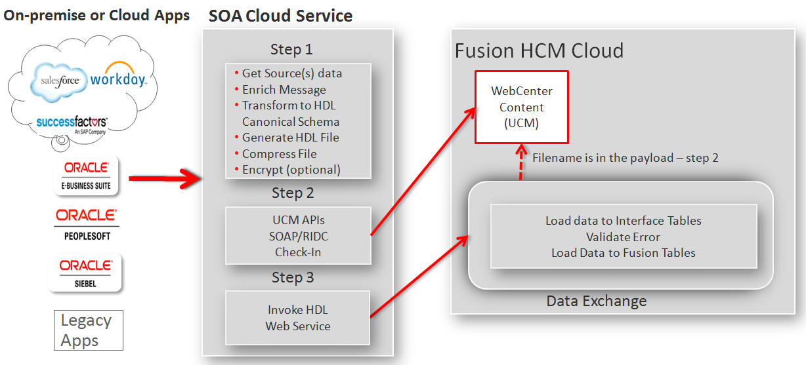
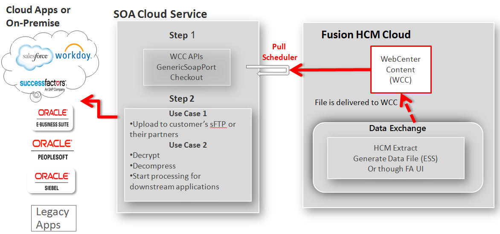

# Loading Data into Oracle HCM using using SOACS

## **Table Of Contents**

- [Introduction](#Introduction)
- [HCM Data Loader](HCMDataLoader)
- [HCM Extracts](HCMExtracts)
- [HCM Inbound Flow](HCMInbound) 
- [HCM Outbound Flow](EXTRACT)
- [Sample Code](SAMPLECODE)
- [Running the code](SAMPLECODE) 

## Introduction 

Oracle Human Capital Management (HCM) Cloud provides a comprehensive set of tools, templates, and pre-packaged integration to cover various scenarios using modern and efficient technologies. One of the patterns is the batch integration to load and extract data to and from the HCM cloud. HCM provides the following bulk integration interfaces and tools:

## HCM Data Loader (HDL) 

HDL is a powerful tool for bulk-loading data from any source to Oracle Fusion HCM. It supports important business objects belonging to key Oracle Fusion HCM products, including Oracle Fusion Global Human Resources, Compensation, Absence Management, Performance Management, Profile Management, Global Payroll, Talent and Workforce Management. For detailed information on HDL, please refer to [this](https://support.oracle.com/epmos/faces/DocumentDisplay?id=1664133.1).

## HCM Extracts 

HCM Extract is an outbound integration tool that lets you select HCM data elements, extracting them from the HCM database and archiving these data elements as XML. This archived raw XML data can be converted into a desired format and delivered to supported channels recipients.

Oracle Fusion HCM provides the above tools with comprehensive user interfaces for initiating data uploads, monitoring upload progress, and reviewing errors, with real-time information provided for both the import and load stages of upload processing. Fusion HCM provides tools, but it requires additional orchestration such as generating FBL or HDL file, uploading these files to WebCenter Content and initiating FBL or HDL web services. This post describes how to design and automate these steps leveraging Oracle Service Oriented Architecture (SOA) Cloud Service deployed on Oracle’s cloud Platform As a Service (PaaS) infrastructure.  For more information on SOA Cloud Service, please refer to [this](https://docs.oracle.com/cloud/latest/soacs_gs/index.html).

Oracle SOA is the industry’s most complete and unified application integration and SOA solution. It transforms complex application integration into agile and re-usable service-based components to speed time to market, respond faster to business requirements, and lower costs.. SOA facilitates the development of enterprise applications as modular business web services that can be easily integrated and reused, creating a truly flexible, adaptable IT infrastructure. For more information on getting started with Oracle SOA, please refer [this](http://docs.oracle.com/middleware/1213/soasuite/index.html). 

These bulk integration interfaces and patterns are not applicable to Oracle Taleo. 

## HCM Inbound Flow (HDL) 

Oracle WebCenter Content (WCC) acts as the staging repository for files to be loaded and processed by HDL. WCC is part of the Fusion HCM infrastructure.

The loading process for FBL and HDL consists of the following steps:

- Upload the data file to WCC/UCM using WCC GenericSoapPort web service
- Invoke the “LoaderIntegrationService” or the “HCMDataLoader” to initiate the loading process.

However, the above steps assume the existence of an HDL file and do not provide a mechanism to generate an HDL file of the respective objects. In this post we will use the sample use case where we get the data file from customer, using it to transform the data and generate an HDL file, and then initiate the loading process.

The following diagram illustrates the typical orchestration of the end-to-end HDL process using SOA cloud service:

 

## HCM Outbound Flow (Extract) 

The “Extract” process for HCM has the following steps:

- An Extract report is generated in HCM either by user or through Enterprise Scheduler Service (ESS)
- Report is stored in WCC under the hcm/dataloader/export account.

However, the report must then be delivered to its destination depending on the use cases. The following diagram illustrates the typical end-to-end orchestration after the Extract report is generated:

For HCM bulk integration introduction including security, roles and privileges, please refer to my blog Fusion HCM Cloud – [Bulk Integration Automation using Managed File Trasnfer (MFT) and Node.js](http://www.ateam-oracle.com/fusion-hcm-cloud-bulk-integration-automation-using-managed-file-transfer-mft-and-node-js/). 

## Sample Code 

This sample contains two sample SOA Composites out of the overall solution to integrate with HCM using SOACS.
	Refer to the complete solution from this location - https://docs.oracle.com/en/solutions/data-load-extract-hcm-cloud/index.html

1. **WccManager**
   - Sample Oracle SOACS composite which demonstrates how to load a file into Fusion HCM UCM repository
2. **HcmHDLoader**
   - Sample Oracle SOACS  composite demonstrating how to trigger the loading of the file, previously loaded by WccManager composite

Pre-requisites are

- A fully configured Oracle Fusion HCM environment, release 12 or higher
- Oracle SOA Suite Cloud Service environment 12.x or higher

## To deploy and run the code 

1. *Download and install JDeveloper 12c*
refer below location for instructions to get Jdeveloper using SOA quickstart. This JDeveloper comes preconfigured with SOA extensions and ready to load and modify the SOA composites provided here.
https://www.oracle.com/uk/middleware/technologies/soasuite/downloads.html
	
2. Load the composites into JDeveloper 12c
Create a SOA Application and import the SOA projects WccManager and HcmHDLoader within it.

3. Modify endpoints to target UCM and HCM 
Modify the SOA Config plan files for the 2 composites and update the location urls to point to UCM webservice and HCM Loader webservice.

4. Deploy and Test the composites to target SOACS service running on Oracle cloud.
* Refer here for instructions on SOACS deployment using JDeveloper

  - https://www.oracle.com/technetwork/middleware/soasuite/learnmore/jdevdeploymenttosoacs-4408368.pdf
* Refer to the solution document at below location for the overall solution
  - https://docs.oracle.com/en/solutions/data-load-extract-hcm-cloud/index.html

